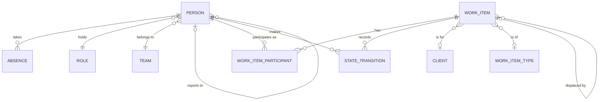
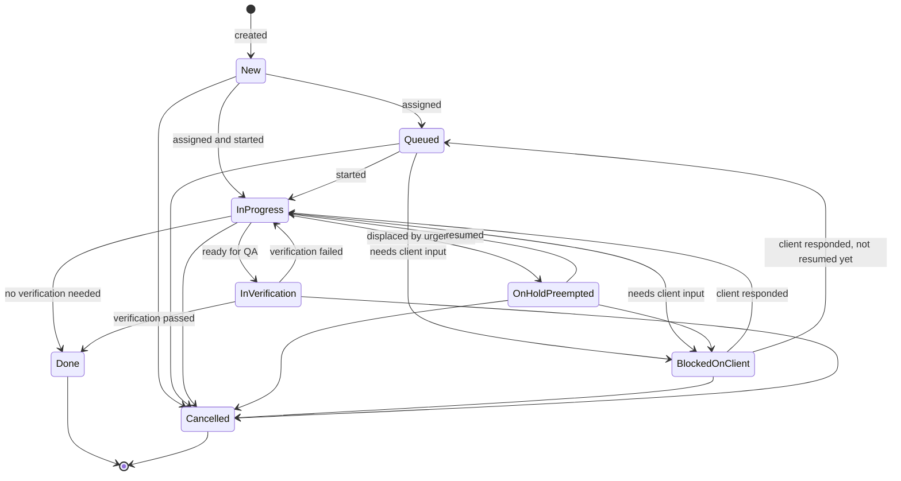

# Domain Model — Resource Planning

| | |
|---|---|
| **Document** | Domain Model v1.0 |
| **Status** | DRAFT — for review |
| **Date** | 2026-08-15 |
| **Phase** | Phase 2 — Domain Model |
| **Derives from** | `docs/03-brd.md` §5, §6, §7; ADR-001; ADR-002 |
| **Feeds** | `11-database-design.md`, `12-api-design.md` |

---

## 0. What a domain model is, and why it comes before the database

A **domain model** is a precise description of the things the business deals
with, how they relate, and the rules that must always hold — expressed in the
business's own language, with no database or framework in it.

**Why it exists.** If you design tables first, the database's convenience starts
making business decisions for you. You end up with a schema that stores data
correctly and enforces nothing, and the business rules leak into whatever code
happens to touch the tables. Six months later "an item on hold must say what
displaced it" is true in three places and false in two.

**Why it matters here.** Nearly everything this product does is *derived* rather
than stored (ADR-001). If the model that produces those derivations is muddled,
every number the system shows is muddled — and unlike a bug, nobody sees it.

**The test of a good domain model:** you can read it aloud to a team lead and
they recognise their own work in it, without you translating.

---

## 1. Concepts used in this document

Each is defined before use, per the project's working agreement.

### Entity
**What:** a thing with a distinct identity that persists over time, even as its
attributes change.
**Test:** if you changed every attribute, would it still be "the same one"?
**Example:** a work item whose title, owner and state have all changed is still
that work item. Identity is what makes it trackable.
**Here:** Person, Team, WorkItem, Client are entities.

### Value object
**What:** a thing defined entirely by its values, with no identity of its own.
Two with the same values are interchangeable.
**Example:** priority "P1" — there is no "this particular P1" as distinct from
"that P1". Contrast a work item, where two items with identical titles are still
two different items.
**Why the distinction matters:** value objects can be freely copied and compared,
need no identity column, and are usually immutable. Getting this wrong produces
tables full of rows that are really just labels.
**Here:** Priority, WorkItemState, DateRange.

### Aggregate and aggregate root
**What:** a cluster of entities and value objects treated as one unit for changes.
The **root** is the single entity through which everything inside is reached and
modified.
**Why it exists:** it answers "what must be consistent at the same instant?"
Rules spanning several objects need a boundary inside which they are always true.
**Example:** a WorkItem and its participants form one aggregate. The rule "an
assigned item has exactly one owner" spans the item and its participants, so they
must change together — you cannot have a moment where an item has two owners
because two separate updates were applied.
**Practical consequence:** one transaction changes one aggregate. Anything
crossing aggregates is eventually consistent, not immediately.
**Here:** WorkItem, Person, Team are roots. Client, Role and WorkItemType are
standalone reference entities.

### Invariant
**What:** a rule that is true at every observable moment, not merely checked
occasionally.
**Why it matters:** invariants belong *inside* the aggregate that owns them. If
enforcement lives in the UI or a service, some other path will eventually bypass
it — and with derived metrics, silently.
**Here:** listed in §6, each traced to a BRD business rule.

### Domain event
**What:** a record that something business-meaningful happened, in the past
tense, with the time it happened.
**Why it exists:** events capture *history*, not just current state. Current state
answers "what is true now"; events answer "how did we get here" and "how long did
that take".
**Why it matters here more than in most systems:** under ADR-001 the event log is
not an audit trail bolted on for compliance — **it is the primary data source**.
Every metric this product produces is computed from it. It is therefore
append-only and load-bearing, and must be modelled as carefully as the entities.

### Domain service
**What:** business logic that doesn't naturally belong to any single entity.
**Test:** if a rule needs several entities and would be arbitrary to attach to any
one of them, it is a domain service.
**Example:** "is this person overloaded?" needs their open items, their history,
and the calendar. It isn't a property of Person alone.
**Here:** listed in §8. Keeping these separate is what stops entities becoming
dumping grounds.

### Bounded context
**What:** a boundary within which a term has exactly one meaning.
**Why it exists:** in large organizations the same word means different things to
different departments — "customer" to sales is a prospect, to finance an account.
Forcing one shared definition produces a model that serves nobody.
**Here:** we have **one bounded context**, "Work Delivery". At ~15 people with one
shared vocabulary, splitting would be ceremony without benefit. §9 records where
the seam would go if that ever changes — so the option stays open without paying
for it now.

---

## 2. Two naming decisions, and why they matter

These look cosmetic. They aren't.

### "Person", not "Developer"

The original brief modelled *Developer*. But QA receives work directly from
clients (K-027, Q3.1), and BAs and managers may own work too. Model *Developer*
as an entity and QA owning a work item becomes an exception to be hacked around —
usually by adding a second table, at which point every query needs a union.

**Decision:** the entity is **Person**. What they do is a Role, which is a
relationship, not an identity. A person's role can change without them becoming a
different person — which is exactly the test for what belongs in an entity versus
what belongs beside it.

### "WorkItem", not "Task"

"Task" implies something decomposed from a plan. This organization's work is
mostly client change requests, bug reports and observations arriving unpredictably
(K-008, A-002 rejected). Calling them tasks would smuggle a planning model back in
through the vocabulary.

**Decision:** **WorkItem**, with a **WorkItemType** distinguishing bug, CR,
observation and anything added later (K-014, K-021).

---

## 3. Entities

### 3.1 WorkItem — the core aggregate root

The central entity. Everything else exists to describe, assign, or measure it.

| Attribute | Type | Required | Notes |
|---|---|---|---|
| id | identity | yes | |
| title | text | **yes — the only required field at creation** | BR-002, D-005 |
| description | text | no | |
| type | → WorkItemType | no | Defaults to a general type; classifiable later |
| client | → Client | no | Addable after creation |
| priority | Priority (value object) | no | Defaults to a middle level; see OPEN-2 |
| state | WorkItemState (value object) | yes | Derived from the latest transition, never set directly |
| due_date | date | no | **Client-given** (K-023, RULE-014). Absent when the client gave none |
| displaced_by | → WorkItem | conditional | Required when state is `OnHoldPreempted` (INV-3) |
| created_by | → Person | yes | |
| created_at | timestamp | yes | |
| version | integer | yes | For concurrent-edit detection — see §10 |

> **Only `title` is required.** This is a business decision (BR-002) expressed in
> the model. Every additional mandatory field is a tax on the recording behaviour
> that all metrics depend on. If a developer must pick a type and a client before
> saving, they will tell a colleague instead — and the record won't exist.

**Contains (inside the aggregate):**

- `participants` — WorkItemParticipant records
- `transitions` — StateTransition records, append-only

### 3.2 WorkItemParticipant

Resolves K-013 (multiple people) and RULE-002/RULE-003 (one accountable owner).

| Attribute | Type | Notes |
|---|---|---|
| work_item | → WorkItem | Part of the WorkItem aggregate |
| person | → Person | |
| participation | `OWNER` \| `COLLABORATOR` | |
| from | timestamp | When they joined |
| to | timestamp \| null | Null while current |

**Why time-bounded rather than a simple link:** BR-015 requires ownership history
to survive reassignment. If reassignment overwrote an `owner_id`, the fact that
Rahul held it for three days before Priya took over would be destroyed — and with
it the ability to answer "who had this when it stalled?"

This single design choice covers all three multi-person scenarios from Q3.3:

| Scenario | How it is modelled |
|---|---|
| (c) Owner plus helpers | One OWNER, several COLLABORATORs, concurrent |
| (d) Handover chain | OWNER row closed, new OWNER row opened |
| (a) Split work | Two separate WorkItems — because they finish independently |

### 3.3 StateTransition — the substrate

**The most important entity in the system**, and the one most likely to be
underestimated.

| Attribute | Type | Notes |
|---|---|---|
| work_item | → WorkItem | |
| from_state | WorkItemState \| null | Null for creation |
| to_state | WorkItemState | |
| occurred_at | timestamp | When it actually happened |
| recorded_at | timestamp | When it was typed in |
| changed_by | → Person | |
| displaced_by | → WorkItem \| null | Set when transitioning to `OnHoldPreempted` |
| note | text | Optional |

> **Why `occurred_at` and `recorded_at` are separate fields.** BR-004 permits
> end-of-day catch-up, so the two genuinely differ. Cycle time must be computed
> from `occurred_at` — otherwise a batch of 6pm updates makes every item look like
> it took a day. The gap between them is also our measure of R-006: if it grows,
> the metrics are drifting, and the system can say so rather than quietly
> misleading people.

**This table is append-only. Rows are never updated or deleted** (INV-2). Every
derived metric in the product reads from it. Editing history would silently
change past measurements — which is why it is an invariant rather than a
convention.

### 3.4 Person

| Attribute | Type | Notes |
|---|---|---|
| id | identity | |
| name | text | |
| email | text | Unique |
| role | → Role | ADR-002 |
| team | → Team | |
| reports_to | → Person \| null | The hierarchy (K-017) |
| normal_load | integer \| null | Their sustained in-progress level (RULE-008, OPEN-4) |
| active | boolean | Left the organization → false, never deleted |
| joined_on / left_on | date | Handles mid-project joiners and leavers |

**Contains:** `absences` — Absence records.

> **`active`, not deletion.** People leave. Their work history is the basis of
> every historical metric, so removing them would corrupt the past. This is the
> same principle as BR-005 for work items.

### 3.5 Absence

| Attribute | Type | Notes |
|---|---|---|
| person | → Person | Inside the Person aggregate |
| period | DateRange (value object) | |
| kind | `LEAVE` \| `HOLIDAY` \| `OTHER` | |
| approved_by | → Person \| null | |

Inside the Person aggregate because the rule "one person's absences must not
overlap" (INV-5) is person-scoped — exactly the test for an aggregate boundary.

### 3.6 Team, Role, Client, WorkItemType, NonWorkingDay

| Entity | Purpose | Notes |
|---|---|---|
| **Team** | Groups people; the unit of default visibility | RULE-011, K-018 |
| **Role** | Reference data, seeded with Developer / QA / Team Lead / Manager / Admin | ADR-002. Rows can be added; permissions stay in code for v1 |
| **Client** | Who the work is for | Enables BR-019 reporting |
| **WorkItemType** | Bug, CR, Observation, and anything added later | K-014, K-021 — reference data, not an enum |
| **NonWorkingDay** | Organization-wide holidays and weekends | BR-014 — excluded from elapsed-time measures |

---

## 4. Relationships

Cardinality worth noting:

| Relationship | Cardinality | Why |
|---|---|---|
| WorkItem → Participant | 1 to many | Multiple people, one accountable (K-013, RULE-002) |
| WorkItem → StateTransition | 1 to many | Full history, never pruned |
| WorkItem → Client | many to **zero-or-one** | Optional — an item can be recorded before the client is known (BR-002) |
| WorkItem → WorkItem (displacement) | zero-or-one | The preemption link (K-020) |
| Person → Person (reports_to) | zero-or-one upward | Hierarchy; a person may have no manager |

---

## 5. Work item lifecycle

### Clock behaviour by state

| State | Counts toward load? | Accountability clock | Counts toward cycle time? |
|---|:---:|:---:|:---:|
| New | No — unowned | Running | Yes |
| Queued | No | Running | Yes |
| InProgress | **Yes** | Running | Yes |
| OnHoldPreempted | No | Running | Yes |
| BlockedOnClient | No | **Stopped** | **No** |
| InVerification | No | Running | Yes |
| Done / Cancelled | No | Ended | — |

> **Load counts only `InProgress`.** Someone with fifteen queued items and one in
> progress is not overloaded — they are working on one thing with a long queue,
> which is a different problem needing a different response. Conflating the two
> would make the load figure useless.

> **Why `BlockedOnClient` stops the clock (RULE-005).** This is the model's
> answer to F-004 and BO-4. Excluding waiting-on-client time from both
> accountability and cycle time means our own performance figures aren't polluted
> by client response delays — and it produces the evidence for "this took eleven
> days, six of which we were waiting for your answer."

### Two deliberate exclusions

**`Done` is terminal.** If a client reports the work wasn't right, that creates a
**new** WorkItem linked to the original, rather than reopening it. Reopening would
mean a single item had several cycle times, and every historical metric would need
to define which one it meant. A follow-up item keeps the history clean and makes
rework visible as its own count — which is more useful than hiding it inside the
original.

**`OnHoldPreempted` only from `InProgress`.** Work that was never started isn't
preempted; it's queued. Allowing preemption from `Queued` would let the personal
backlog masquerade as displacement and inflate BO-4's numbers.

---

## 6. Invariants

Rules that hold at every observable moment, enforced inside the aggregate that
owns them.

| ID | Invariant | Owner | From |
|---|---|---|---|
| **INV-1** | An assigned WorkItem has exactly one current OWNER participant (`to` is null) | WorkItem | RULE-002 |
| **INV-2** | StateTransitions are append-only — never updated, never deleted | WorkItem | ADR-001, BR-005 |
| **INV-3** | A WorkItem in `OnHoldPreempted` must reference the WorkItem that displaced it | WorkItem | RULE-004, BR-009 |
| **INV-4** | A WorkItem cannot displace itself, and displacement chains must not form a cycle | WorkItem | Integrity |
| **INV-5** | One person's absence periods must not overlap | Person | Integrity |
| **INV-6** | A WorkItem cannot leave `New` without an OWNER | WorkItem | RULE-001 |
| **INV-7** | `state` always equals the `to_state` of the most recent transition by `occurred_at` | WorkItem | Consistency |
| **INV-8** | Only transitions in §5 are permitted; anything else is rejected | WorkItem | Lifecycle |
| **INV-9** | `Done` and `Cancelled` are terminal | WorkItem | §5 |
| **INV-10** | A WorkItem is never deleted; unwanted work is `Cancelled` | WorkItem | BR-005 |
| **INV-11** | A Person is never deleted; departure sets `active = false` | Person | Historical integrity |
| **INV-12** | `occurred_at` must not be in the future, and must not precede the item's creation | WorkItem | Data quality |

> **INV-7 is worth dwelling on.** `state` is a *cached derivation* of the
> transition log, not an independent fact. Storing it is a performance
> convenience; the log is the truth. Any code that sets `state` without appending
> a transition has created a lie the metrics will faithfully report.

---

## 7. Domain events

Emitted by aggregates when something business-meaningful happens. Under ADR-001
these are the raw material for every metric.

| Event | Emitted when | Consumed for |
|---|---|---|
| `WorkItemCreated` | An item is recorded | BO-1 recording rate |
| `WorkItemAssigned` | An OWNER is set | Load, assignment history |
| `WorkItemReassigned` | OWNER changes | BR-015 ownership history |
| `WorkItemStateChanged` | Any transition | Cycle time, throughput, staleness |
| `WorkItemPreempted` | → `OnHoldPreempted` | BO-4 lateness causes |
| `WorkItemBlockedOnClient` | → `BlockedOnClient` | Clock suspension, BO-4 |
| `VerificationFailed` | `InVerification` → `InProgress` | Rework rate |
| `WorkItemCompleted` | → `Done` | Throughput, cycle time |
| `AbsenceRecorded` | Absence created | BO-3 cover detection |

> These are **domain** events — facts about the business, in its language. They
> are not message-queue infrastructure. In a modular monolith they can be plain
> in-process notifications. Naming them now means that if the system ever needs
> asynchronous processing, the seam already exists.

---

## 8. Domain services

Logic belonging to no single entity.

| Service | Answers | Inputs | Traces to |
|---|---|---|---|
| **LoadService** | "What is this person carrying? Are they above their normal level?" | WorkItems in `InProgress`, Person.normal_load | BR-008, BR-016 |
| **AvailabilityService** | "Can this person take work right now?" | Load, Absence, NonWorkingDay | BR-016, BO-5 |
| **FlowStatisticsService** | "How long do items like this usually take? How many do we finish a week?" | StateTransitions, NonWorkingDay | BR-018, BO-6 |
| **RiskService** | "What is likely to miss its due date?" | Item age, flow statistics, due_date | BR-017, RULE-009 |
| **StalenessService** | "What has stopped moving?" | Latest transition per open item | BR-007, BO-2 |
| **CoverService** | "Whose absence leaves work uncovered?" | Absence, open items by owner | BR-013, BO-3 |
| **ExplanationService** | "Where did this number come from?" | Whatever produced it | **BR-020** |

> **ExplanationService is not optional decoration.** Every figure here is derived,
> and BR-020 requires each to be traceable to its inputs. Practically: each
> service returns its result *together with* the evidence — the items counted, the
> history sampled, the sample size. The first surprising number a lead cannot
> interrogate costs trust in all the others.

**FlowStatisticsService must refuse to answer below a minimum sample** (RULE-013).
Returning "not enough history yet" is a valid, correct result and must be
representable in the return type — not signalled by returning zero.

---

## 9. Module boundaries

One bounded context, four modules within the monolith. Modules may call each
other only through named services, never by reaching into another's tables.

| Module | Owns | Exposes |
|---|---|---|
| **work** | WorkItem, Participant, StateTransition, WorkItemType, Client | Item CRUD, transitions, assignment |
| **people** | Person, Team, Role, Absence, NonWorkingDay | Directory, absence, calendar |
| **flow** | No entities — reads `work` and `people` | Load, availability, statistics, risk, staleness |
| **access** | No entities — reads `people` | Permission checks (the ADR-002 seam) |

> **`flow` owns no tables deliberately.** It is pure computation over the other
> modules' data. That keeps ADR-001's derivations in one place instead of
> scattered through query code, and makes them independently testable — which
> matters, because these calculations are the part most likely to be subtly wrong
> and least likely to announce it.

**If this ever needs splitting into separate bounded contexts**, the seam is
between `work`+`flow` (delivery) and `people` (organization). That is where the
vocabulary would first diverge — HR's "employee" is not delivery's "owner". Not
worth doing at ~15 people; recorded so the option remains cheap.

---

## 10. Concurrency

> **Correction, 2026-08-15.** The original brief listed *"two managers attempt to
> assign the same developer simultaneously"* as an edge case. The stakeholder has
> since confirmed this does not occur: **assignment is centralized — one manager
> assigns** (K-028). The scenario is withdrawn. The analysis below is retained
> because it explains why the scenario would not have been a problem regardless,
> and because a genuine concurrency case remains.

**Even had two managers been able to assign simultaneously, that would not be a
conflict under this model** — and the reason is worth understanding, because it
shows a good foundational decision removing downstream complexity.

Hour-based capacity systems *reserve* capacity: assigning consumes a budget, so
two simultaneous assignments can overdraw it, and you need locking to prevent
double-booking. Under ADR-001 nothing is reserved. Load is **derived by counting**
in-progress items. Two people assigning two items to one person produces a person
with two more items and a visible load increase. That is not an error — it is an
accurate description of what just happened to them, and exactly what BR-008
should surface.

**What still needs protection** is two people editing the *same* work item at
once. With centralized assignment this is now the realistic case rather than the
exotic one: the manager reassigns an item at the same moment its current owner
moves it to another state.

**Approach: optimistic locking.** Each WorkItem carries a `version`. A write
includes the version it read; if the stored version has moved on, the write is
rejected and the caller re-reads and retries.

- **"Optimistic"** because it assumes conflicts are rare and only detects them,
  rather than locking rows up front and making everyone wait.
- **Why it suits this system:** with ~15 people, two simultaneous edits to the
  same item are genuinely rare. Pessimistic locking would impose a permanent cost
  to prevent an occasional problem.
- **The alternative, and why not:** pessimistic locking (`SELECT FOR UPDATE`)
  holds a database lock for the duration of the edit. Correct, but it can block
  and deadlock, and here it would be paying constantly for a rare event.

State transitions are naturally append-only, so a lost update is impossible there
— but INV-7 (`state` mirrors the latest transition) means the cached `state` still
needs the version check to stay consistent.

---

## 11. What is deliberately absent

Every omission is a decision, not an oversight.

| Not modelled | Why |
|---|---|
| Estimate, TimeEntry, EffortLog | ADR-001 — the data will not be entered |
| CapacityAllocation, percentage allocation | No hours to allocate |
| Skill, PersonSkill, SkillRequirement | BRD §8.2 — nobody maintains a skills matrix; an unmaintained one is worse than none |
| TaskDependency, blocking graph | Splitting and handover are rare (K-026); high complexity for a rare case |
| Project, ProjectPhase, Sprint | Work is queue-shaped, not plan-shaped (A-002 rejected). **Client** covers grouping. Revisit if OPEN-3 resolves toward products |
| Subtask / parent-child items | Splitting is rare and modelled as separate linked items |
| Permission, Grant, RoleAssignment tables | ADR-002 — permissions live in code for v1 |
| Notification, Subscription | No requirement yet; staleness is surfaced on screen, not pushed |
| Client as a system user | Clients are not users (BRD §8.2) |

> **On absent entities generally.** Each of these would be defensible in a larger
> product. Every one also adds tables, rules, screens and tests. The BRD's
> exclusions are enforced here in the model, because an entity added "just in
> case" is an entity someone will eventually feel obliged to populate.

---

## 12. Traceability

| BRD rule | Model expression |
|---|---|
| RULE-001 unowned items | WorkItem in `New`, no OWNER participant (INV-6) |
| RULE-002 one owner | INV-1 |
| RULE-003 load counts owner only | LoadService counts OWNER participations in `InProgress` |
| RULE-004 preemption recorded | INV-3, `displaced_by` |
| RULE-005 blocked clock stops | §5 clock table |
| RULE-006 P0–P4 | Priority value object |
| RULE-007 overload is personal | Person.normal_load, LoadService |
| RULE-008 normal level tuned from history | Person.normal_load + FlowStatisticsService |
| RULE-009 at risk | RiskService |
| RULE-010 ranges not dates | FlowStatisticsService return type |
| RULE-011 team-level visibility | Person.team + access module |
| RULE-012 reassignment recorded | Time-bounded WorkItemParticipant |
| RULE-013 minimum sample | FlowStatisticsService refuses below threshold |
| RULE-014 client due dates | WorkItem.due_date, never system-set |
| BR-020 explainability | ExplanationService; services return evidence with results |

---

## 13. Open questions this model does not resolve

| ID | Question | Effect on the model |
|---|---|---|
| **OPEN-2** | Who sets priority; does P0 preempt automatically? | Behavioural rule, not structural — no schema change either way |
| **OPEN-3** | Group work by client/product? | Client is modelled. A separate Product entity would be additive |
| **OPEN-4** | Default starting value for `normal_load` | A seeded number. **Proposal: start at 3**, tune per person after four weeks of history |
| **OPEN-5** | Does every item pass through verification? | Currently optional (`InProgress → Done` allowed). If mandatory for some types, becomes a per-type rule — additive |
| **OPEN-6** | What managers decide weekly | May add services; unlikely to change entities |
| ~~OPEN-7~~ | ~~Who may assign work?~~ **CLOSED** — anyone may assign; see §13a | None |

None of these block the database design. All are additive or behavioural.

---

## 13a. C-007 — who assigns work: RESOLVED

**Raised 2026-08-15. Resolved 2026-08-15.**

**Answer: anyone recording work may put a name on it.** Assignment is not
reserved to the manager.

This reconciles the sources that appeared to conflict:

| Source | Status after resolution |
|---|---|
| Q2.2 — developers select an assignee from a dropdown | **Correct, and normative** |
| K-028 — "one manager assigns" | Describes that the organization has **one manager**, who does managerial allocation. Not an exclusive permission |
| K-015 — Team Lead notices stalled work | Unaffected — noticing is not assigning |
| BRD role matrix — assignment restricted to Lead/Manager | **Wrong. Corrected** — Developer and QA may assign within their own team |

### The consequence worth stating plainly

Round 2 identified a risk: if several people can hand work to the same person
without knowing about each other, that alone explains much of the overload
problem. Open assignment does not remove that risk.

**The mitigation is visibility, not permission.** Three properties of this design
already address it:

1. Nothing is *reserved* (ADR-001), so a second assignment is never a silent
   double-booking — it is simply a visible increase in that person's load.
2. Load is shown to the whole team (RULE-011, BR-008), so the second assigner can
   see what the first one did before deciding.
3. Every assignment is recorded with who did it and when, so a pattern of one
   person overloading another is visible rather than anecdotal.

This is consistent with D-003 — visibility first, control later if evidence
demands it. **Restricting assignment now would be solving a problem we have not
yet observed, at the cost of the friction the whole design is trying to avoid.**

**Revisit if:** the load data, once real, shows people being overloaded by
uncoordinated assignment. At that point restriction becomes evidence-based rather
than speculative — one rule in the `access` module, no structural change.

---

## 14. Change log

| Version | Date | Change |
|---|---|---|
| 1.0 | 2026-08-15 | Initial model from BRD v1.0, ADR-001, ADR-002 |
| 1.1 | 2026-08-15 | K-028: assignment is centralized, one manager assigns. Two-manager concurrency scenario withdrawn from §10. Contradiction C-007 raised (§13a) with a working assumption; no structural impact |
| 1.2 | 2026-08-15 | C-007 resolved: anyone recording work may assign it. Role matrix corrected. Mitigation for uncoordinated assignment is visibility, not permission |
